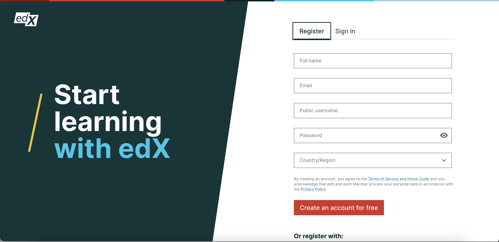
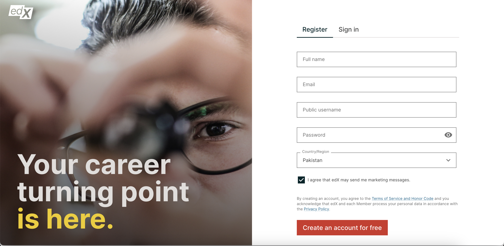

========================================
Modifying the Base Container in Authn
========================================

The base container in Authn serves as the fundamental layout structure for rendering different components based on configurations. This document outlines the process for modifying the base container to accommodate changes or customize layouts as needed.

Understanding Base Container Versions
--------------------------------------

The base container supports two main versions:

- **Default Layout:** The default layout is the standard layout used when specific configurations do not dictate otherwise.

- **Image Layout:** The image layout is an alternative layout option that can be enabled based on configurations.

Enabling the Image Layout
---------------------------

The image layout is enabled through app configuration, not a ``.env`` file.  Set
``ENABLE_IMAGE_LAYOUT`` to ``true`` and supply a banner image per breakpoint,
either in edx-platform through ``FRONTEND_SITE_CONFIG`` or directly on the app in
a site config::

    {
      ...authnApp,
      config: {
        ENABLE_IMAGE_LAYOUT: true,
        BANNER_IMAGE_EXTRA_SMALL: 'https://example.com/banner-xs.jpg',
        BANNER_IMAGE_SMALL: 'https://example.com/banner-sm.jpg',
        BANNER_IMAGE_MEDIUM: 'https://example.com/banner-md.jpg',
        BANNER_IMAGE_LARGE: 'https://example.com/banner-lg.jpg',
      },
    }

Each banner is optional: where one is not set, that breakpoint falls back to a
flat background rather than an image.

This allows for the customization and adaptation of the base container layout
according to specific requirements.
