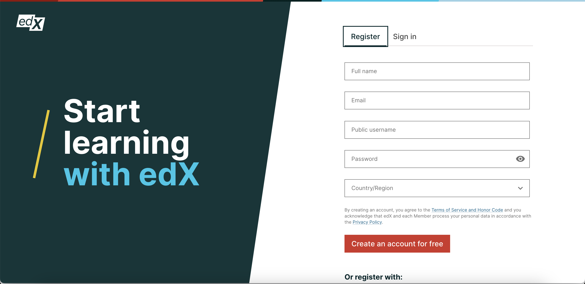

========================================
Modifying the Base Container in Authn
========================================

The base container in Authn serves as the fundamental layout structure for rendering different components based on configurations. This document outlines the process for modifying the base container to accommodate changes or customize layouts as needed.

Understanding Base Container Versions
--------------------------------------

The base container supports two main versions:

- **Default Layout:** The default layout is the standard layout used when specific configurations do not dictate otherwise.

- **Image Layout:** The image layout is an alternative layout option that can be enabled based on configurations.

Enabling the Image Layout
---------------------------

To activate the image layout feature, navigate to your .env file and update the configurations:

**Update Configuration**

Locate the ``ENABLE_IMAGE_LAYOUT`` parameter and set its value to  ``true``. Additionally, ensure that the Image configuration settings are provided. Your overall configurations should resemble the following:

   .. code-block::

      # ***** Image Layout Configuration *****
      ENABLE_IMAGE_LAYOUT = True  # Set to True to enable image layout feature

      # ***** Base Container Images *****
      BANNER_IMAGE_LARGE='' # Path to the large banner image
      BANNER_IMAGE_MEDIUM='' # Path to the medium-sized banner image
      BANNER_IMAGE_SMALL=''  # Path to the small banner image
      BANNER_IMAGE_EXTRA_SMALL=''  # Path to the extra-small banner image

This allows for the customization and adaptation of the base container layout according to specific requirements.