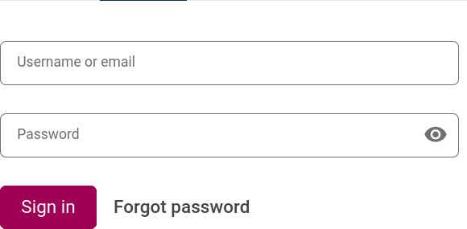
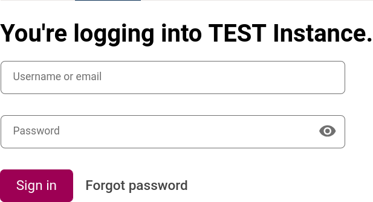

# Login Component Slot

### Slot ID: `org.openedx.frontend.authn.login_component.v1`

## Description

This slot is used to replace/modify/hide the login component.

## Example

### Default content


### With a prepended message


The following `env.config.jsx` will add a message before the login component.

```js
import { DIRECT_PLUGIN, PLUGIN_OPERATIONS } from '@openedx/frontend-plugin-framework';

// Load environment variables from .env file
const config = {
  ...process.env,
  pluginSlots: {
    'org.openedx.frontend.authn.login_component.v1': {
      keepDefault: true,
      plugins: [
        {
          op: PLUGIN_OPERATIONS.Insert,
          widget: {
            id: 'test_plugin',
            type: DIRECT_PLUGIN,
            priority: 1,
            RenderWidget: () => (
              <h2>You're logging into TEST Instance.</h2>
            )
          },
        },
      ],
    },
  },
};

export default config;

```
