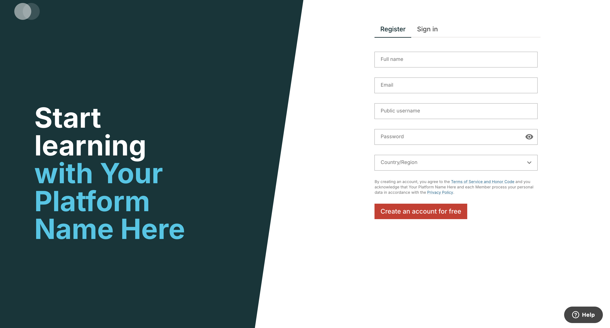

# Main App Slot

### Slot ID: `main_app_slot`

## Description

This slot is used for adding content at the root level.

## Example

The following `env.config.jsx` will render a component at the MFE root level.



```js
import {
  DIRECT_PLUGIN,
  PLUGIN_OPERATIONS,
} from "@openedx/frontend-plugin-framework";
import { ExampleComponent } from "@openedx/frontend-plugin-example";

const config = {
  pluginSlots: {
    main_app_slot: {
      plugins: [
        {
          op: PLUGIN_OPERATIONS.Insert,
          widget: {
            id: "example-component",
            type: DIRECT_PLUGIN,
            priority: 60,
            RenderWidget: ExampleComponent,
          },
        },
      ],
    },
  },
};

export default config;
```
