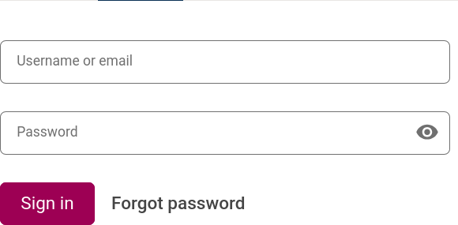
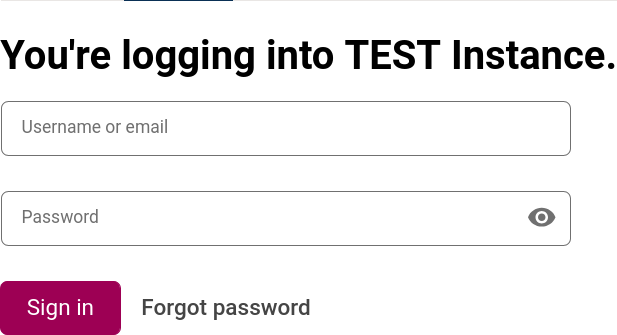

# Login Component Slot

### Slot ID: `org.openedx.frontend.slot.authn.loginComponent.v1`

## Description

This slot is used to replace/modify/hide the login component.

## Example

### Default content

### With a prepended message

The site configuration can be used to add a widget before the login component
using the slot's `PREPEND` operation. Refer to the `@openedx/frontend-base`
Slot documentation for configuration details.
